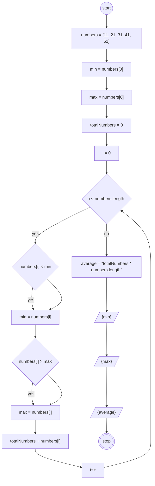

# Algoritma

## Flowchart

```mermaid
flowchart TD

start@{shape: circle, label: "start"}
1@{shape: rect, label: "numbers = [11, 21, 31, 41, 51]"}
2@{shape: rect, label: "min = numbers[0]"}
3@{shape: rect, label: "max = numbers[0]"}
4@{shape: rect, label: "totalNumbers = 0"}
5@{shape: rect, label: "i = 0"}
6@{shape: diamond, label: "i < numbers.length" }
7@{shape: rect, label: "i++" }
8@{shape: diamond, label: "numbers[i] < min" }
9@{shape: rect, label: "min = numbers[i]"}
10@{shape: diamond, label: "numbers[i] > max"}
11@{shape: rect, label:  "max = numbers[i]" }
12@{shape: rect, label: "totalNumbers + numbers[i]"}
13@{shape: rect, label : average = "totalNumbers / numbers.length"}
14@{shape: lean-r, label: "{min}"}
15@{shape: lean-r, label: "{max}"}
16@{shape: lean-r, label: "{average}"}
stop@{shape: dbl-circ, label: "stop"}


start-->1
1-->2
2-->3
3-->4
4-->5
5-->6
6-- no -->13
13-->14
14-->15
15-->16
6--yes-->8
8--yes-->9
8-->9
9-->10
10--yes-->11
10-->11
11-->12
12-->7
7-->6
16-->stop


```
